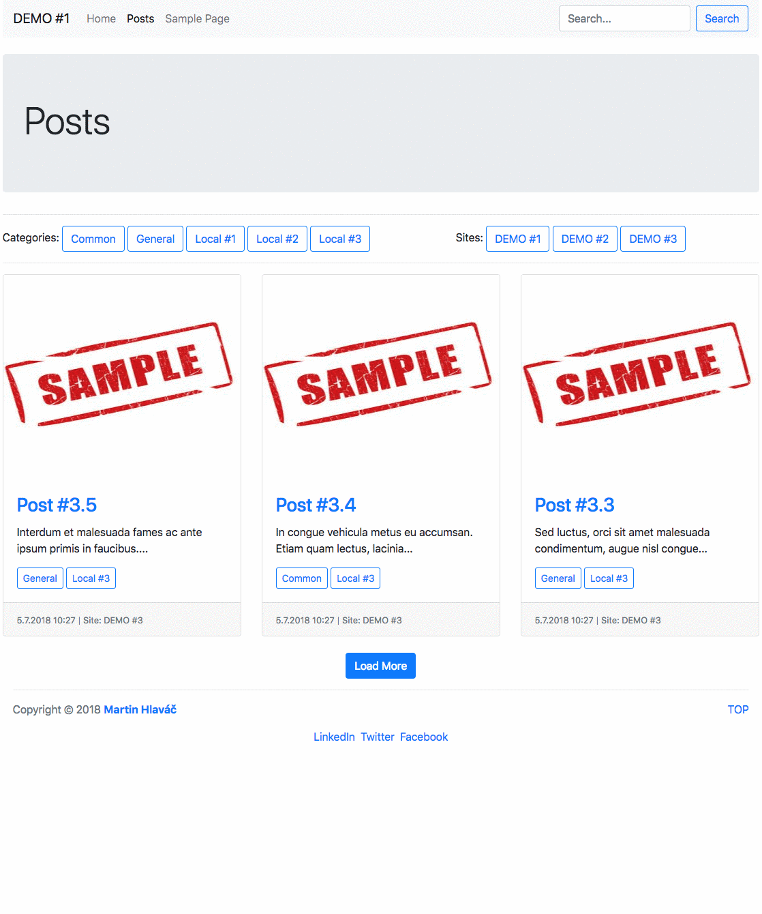

# WPFW multisite WPDB

Resources and example [WordPress](https://wordpress.org/) theme based on [WPFW Skeleton](https://github.com/ktstudio/WPFW-Skeleton) (CZ) and [WP Framework](https://github.com/ktstudio/WP-Framework/) (CZ) for [multisite](https://codex.wordpress.org/Create_A_Network) custom query demonstration (with [WPDB](https://codex.wordpress.org/wpdb)).

Blog post is available on the [Medium.com](https://medium.com/@hlavacm/wpfw-multisite-wpdb-1f3ee6a4181b) (CZ).

## Demo Animation

## Access Data

Sample app database (script for restore): **wpfw-multisite-wpdb.sql**

**URL:** http://localhost/wpfw-multisite-wpdb/(wp-admin)

**login / password:** admin / RsB16kvy6zd0